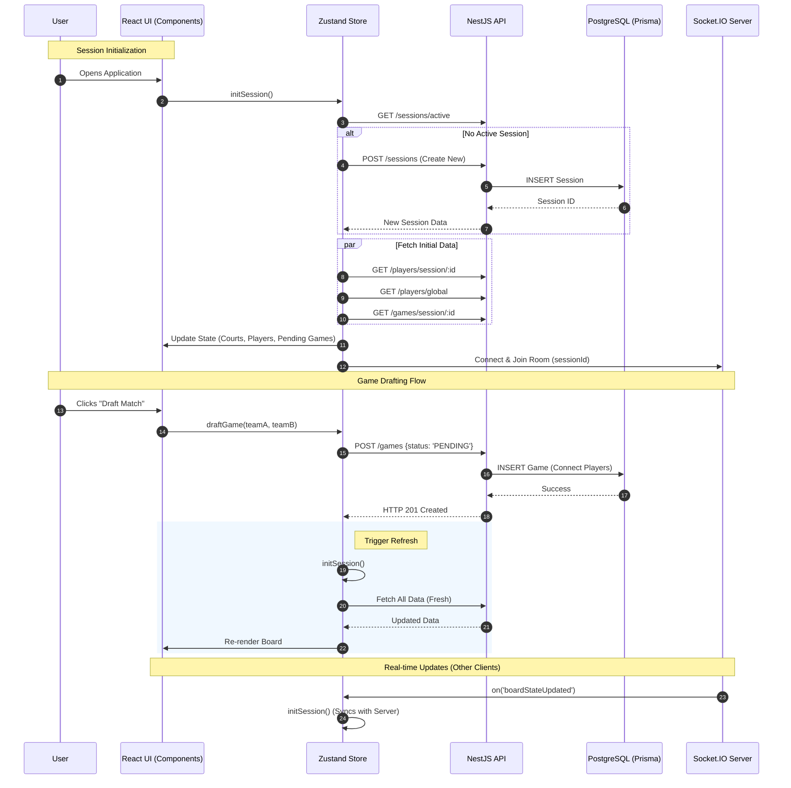

# SmashQueueV1 Data Flow

This document outlines the high-level data flow between the Frontend Client, the Store, and the Backend Services.

```mermaid
sequenceDiagram
    autonumber
    participant User
    participant UI as React UI (Components)
    participant Store as Zustand Store
    participant API as NestJS API
    participant DB as PostgreSQL (Prisma)
    participant Socket as Socket.IO Server

    Note over User, UI: Session Initialization
    User->>UI: Opens Application
    UI->>Store: initSession()
    Store->>API: GET /sessions/active
    alt No Active Session
        Store->>API: POST /sessions (Create New)
        API->>DB: INSERT Session
        DB-->>API: Session ID
        API-->>Store: New Session Data
    end
    
    par Fetch Initial Data
        Store->>API: GET /players/session/:id
        Store->>API: GET /players/global
        Store->>API: GET /games/session/:id
    end
    
    Store->>UI: Update State (Courts, Players, Pending Games)
    Store->>Socket: Connect & Join Room (sessionId)

    Note over User, Socket: Game Drafting Flow
    User->>UI: Clicks "Draft Match"
    UI->>Store: draftGame(teamA, teamB)
    Store->>API: POST /games {status: 'PENDING'}
    API->>DB: INSERT Game (Connect Players)
    DB-->>API: Success
    API-->>Store: HTTP 201 Created
    
    rect rgb(240, 248, 255)
        Note right of Store: Trigger Refresh
        Store->>Store: initSession()
        Store->>API: Fetch All Data (Fresh)
        API-->>Store: Updated Data
        Store->>UI: Re-render Board
    end

    Note over Socket, UI: Real-time Updates (Other Clients)
    Socket->>Store: on('boardStateUpdated')
    Store->>Store: initSession() (Syncs with Server)
```